```{r setup, include=FALSE}
knitr::opts_chunk$set(warning = FALSE, 
                      message = FALSE, 
                      comment=FALSE)
```

```{r ,echo=FALSE}
library(tidyverse)
library(lubridate)
```


class: center

```{r xaringan-themer, include=FALSE, warning=FALSE, eval=FALSE}
library(xaringanthemer)
#style_mono_light(base_color = "#23395b")
#style_duo_accent(primary_color = "#FFFFFF", secondary_color = "#FA795E")
style_duo_accent(primary_color = "#FA795E",
                 secondary_color = "#FFFFFF",
                 header_h1_font_size = "1.8rem",
                 header_h2_font_size = "1.5rem",
                 header_h3_font_size = "1.0rem"
                 )
#style_duo_accent_inverse(primary_color = "#FFFFFF", secondary_color = "#FA795E")
#style_duo_accent_inverse(primary_color = "#FA795E", secondary_color = "#FFFFFF")
```


```{r, echo=FALSE}
knitr::include_graphics('fondo_fce.png')
```

<br>
<br>
<br>
<br>

```{r, echo=FALSE}
 
```

<br>
<br>

#### 2021-06-29
---
class: center

```{r, echo=FALSE}
knitr::include_graphics('fondo_fce.png')
```

<br>
<br>
<br>

# Asignatura: Metodologías avanzadas de aprendizaje automático para la gestión en las organizaciones

<br>

## Segunda Evaluación

#### Rafael Zambrano

---

# Ocurrencia de delitos

🔸 La ocurrencia de delitos es un fenomeno de índole social y económico, dado lo amplio y transversal que resulta estudiar este tópico, se aborda el tema mediante una relación funcional entre la problemática y **la dualidad “entorno-tiempo”**. 

<br>
<br>

---
# Campos de aplicación actual

🔸 Computer vision

```{r, echo=FALSE, out.width='40%',out.height='40%',fig.align='center'}

```

---
# Campos de aplicación actual

🔸 Sound / Text Analysis

```{r, echo=FALSE, out.width='70%',out.height='70%',fig.align='center'}

```

---
# Campos de aplicación actual

🔸 Temporal-Geographic analysis

* [Predictable Policing: Measuring the Crime Control Benefits of Hotspots Policing at Bus Stops](https://link.springer.com/article/10.1007/s10940-016-9312-y)

* [Prediction of Suspect Location Based on Spatiotemporal Semantics](https://www.mdpi.com/2220-9964/6/7/185/htm)

* [Grid-Based Crime Prediction Using Geographical Features](https://www.mdpi.com/2220-9964/7/8/298/htm)

---
# Resumen

🔸 En la ciudad de Taoyuan (Taiwán), se realizó un estudio de predicción de delitos basado en cuadrículas, comparando el rendimiento de **modelos de aprendizaje automático con un modelo de aprendizaje profundo**. 

🔸 Se aplicó un esquema de modelado basado en cuadrículas geográficas, este permitió  establecer una gama de características espacio-temporales basadas en 84 variables.

🔸 Fueron seleccionados los delitos del tipo **“robo de vehículo”**, para el periodo enero - 2015 / abril - 2018, realizando predicciones para el periodo enero - 2017 / abril - 2018.

🔸 Se estableció una línea base, que consistió en una media móvil de los últimos 11 meses para predecir el mes número 12. Fueron implementados modelos de aprendizaje automático como Random Decision Forest, Support Vector Machine y K-Near Neighbor, además, se implementó un modelo DNN.

🔸 El modelo de DNN resultó ser el que obtuvo un mejor rendimiento, en función de la métrica F1, mostrando una mejora de aproximadamente el 7% sobre el modelo base.

---

# Problemática

🔸 Taoyuan es una de las ciudades más grandes de Taiwán con una población de 2,1 millones para 2018.  Entre 2015 a 2016 se registró un promedio anual de alrededor de 20.000 delitos.

🔸 Según el Índice de delitos [NUMBEO](https://www.numbeo.com/crime/in/Taoyuan) de 2018, el puntaje de delitos de Taoyuan fue de 27,5 , que es más alto que el promedio en Taiwán ( 20.74).

---

# Problemática
 
## Enfoque tradicional
 
* Modelos espacio-temporales
 
🔸 Estos métodos incluyen la estimación de densidad de kernel (KDE) y modelos de series temporales. Sin embargo, estos dos métodos solo consideran el tiempo o el espacio de forma independiente, pero el crimen se ve afectado por más de un factor.
 
--
 
🔸 Cuando este enfoque se aplica en base a cuadrículas espaciales, sólo se examinan factores como el tiempo, el espacio y el tipo de delito, pero rara vez se discuten las características geográficas de la cuadrícula.
 
---

# Transformación y limpieza de datos
 
* **Fuente de datos**
 
🔸 Este estudio integra aspectos experienciales con características geográficas adicionales para simular el entorno delictivo y permitir modelos de predicción de delitos basados.
 
🔸 Los delitos registrados se extrajeron de un repositorio de datos abiertos del gobierno de Taiwán. [Link Repostiorio](https://data.gov.tw).   
 
🔸 Se extraen y generan características espacio-temporales basadas en 84 tipos de información geográfica mediante la API de Google Places, estos datos se enlazan con el registro de delitos de la ciudad.

--

```{r, echo=FALSE, out.width='60%',out.height='40%', fig.align='center'}

```

---

# Transformación y limpieza de datos
 
## EDA
 
* Incidencia histórica de delitos

```{r, echo=FALSE, out.width='70%',out.height='40%', fig.align='center'}
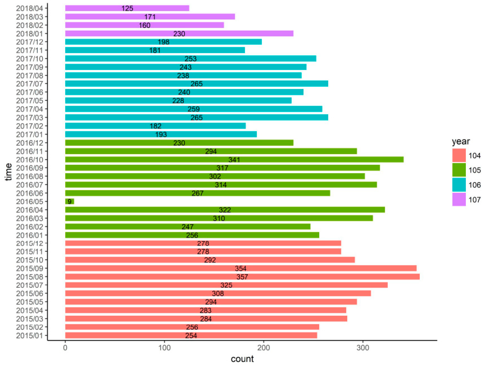
```

---
# Transformación y limpieza de datos
 
## Creación de cuadrículas espaciales

```{r, echo=FALSE, out.width='80%', fig.align='center'}
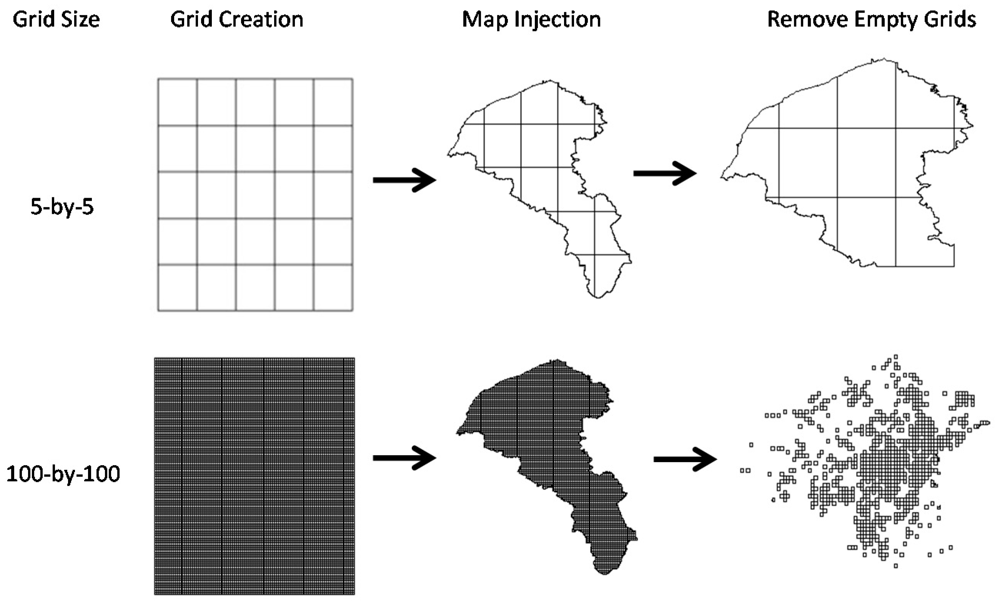
```

🔸 Se calcula el número de delitos ocurridos dentro de cada cuadrícula para cada uno de los meses de estudio.

---
# Transformación y limpieza de datos
 
## Esquema de partición de datos

<br>

```{r, echo=FALSE, out.width='80%', fig.align='center'}
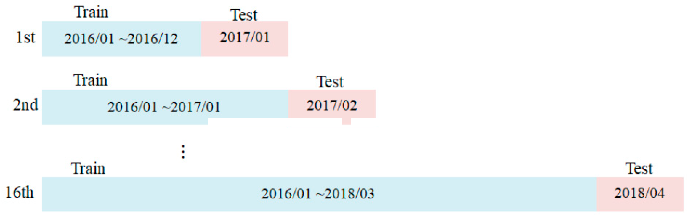
```

---
# Transformación y limpieza de datos
 
## Creación de variables delictivas
 
🔸 Temporales:
 
* Cálculo acumulativo de delitos en ventanas de tiempo (condición demográfica).
* Cálculo de delitos ocurridos en el mismo mes del año anterior (patrón estacional).
 
🔸 Espaciales:
 
* Características de la cuadrícula (simulación de escenas delictivas).
* Cuadrículas adyacentes (desplazamiento del delito).

---

# Transformación y limpieza de datos
 
## Creación de variables delictivas

```{r, echo=FALSE, out.width='80%', fig.align='center'}
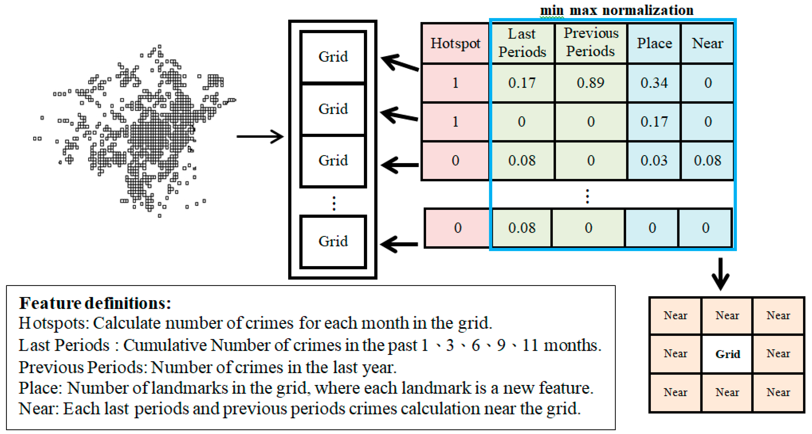
```

---

# Modelo Base

<br>

🔸 Medias móviles

```{r, echo=FALSE, out.width='80%', fig.align='center'}
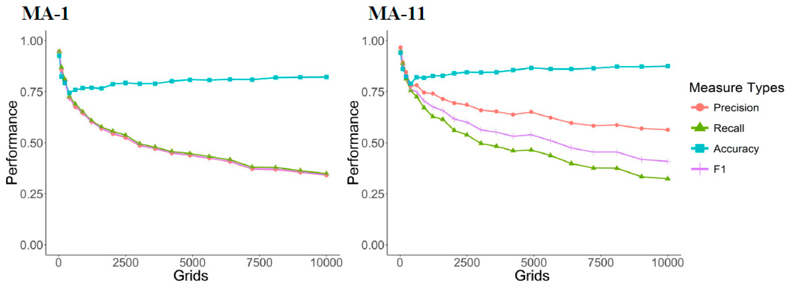
```

---

# Modelos de Aprendizaje automático

🔸 K-Nemost Neighbor (KNN)

🔸 Support Vector Machine (SVM) 

🔸 Random Decision Forest (RF )

* Ejemplo del ajuste del modelo KNN

```{r, echo=FALSE, out.width='80%', fig.align='center'}
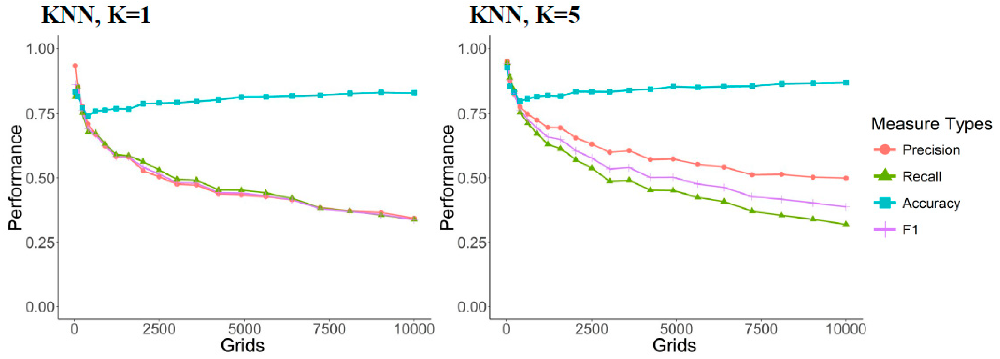
```

---

# Modelo de Aprendizaje Profundo
 
🔸 Se utilizó un modelo de DNN de capas ocultas profundas con un mecanismo de dropout con las siguientes características:
 
* 9 capas con 100 neuronas cada una.
* Dropout de 0.2 para todas las capas
* Se usó ReLu como función de activación, presentó un mejor rendimiento que la función sigmoide.
* 45 épocas.
* Tasa de aprendizaje de 0.001
* Se utilizó el framework de deep learning de h2o.

---

# Modelo de Aprendisaje Profundo

* Estructura del modelo DNN

```{r ,eval=FALSE}
 model_dp =  h2o.deeplearning(x = dataX,
                              y = dataY,
                              training_frame = dtrain,
                              hidden = c(100,100,100,100,100,100,100,100,100),
                              activation = "RectifierWithDropout",
                              input_dropout_ratio = 0.2,
                              hidden_dropout_ratios = rep(0.2,9),
                              rate = 0.001,
                              epochs = 45)
```

---

# Comparación de modelos

<br>

```{r, echo=FALSE, out.width='80%', fig.align='center'}
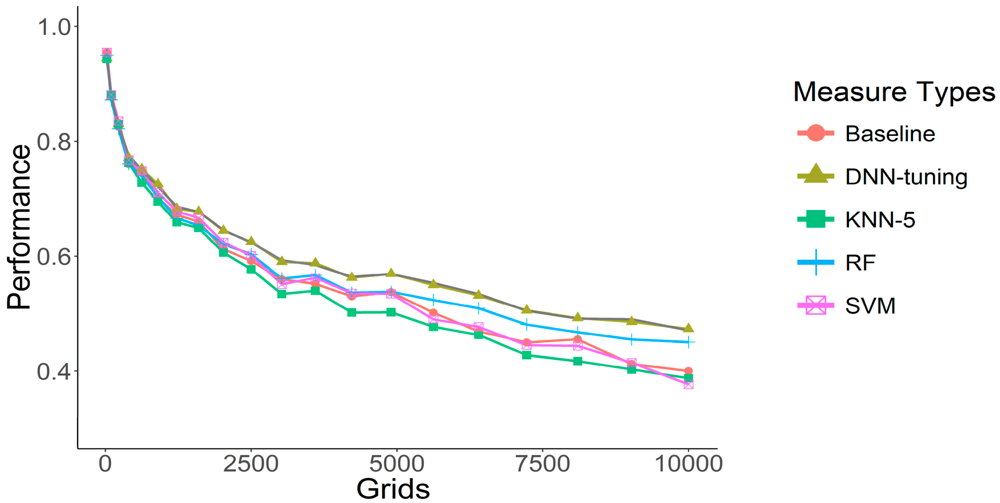
```

---

# Comparación de modelos

🔸 Se utilizó una prueba t para determinar si la diferencia de rendimiento entre estos métodos era estadísticamente significativa

<br>

```{r, echo=FALSE, out.width='80%', fig.align='center'}
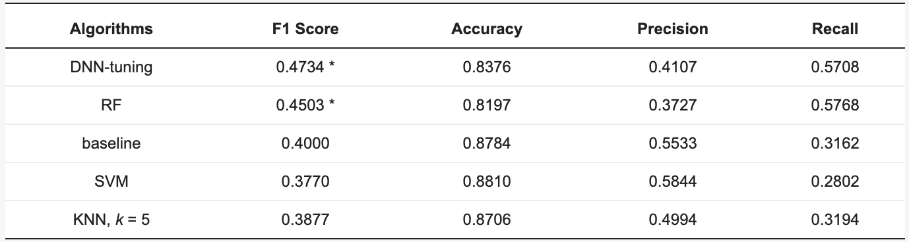
```

---

# Rendimiento del modelo DNN para cada partición.

<br>

```{r, echo=FALSE, out.width='80%', fig.align='center'}
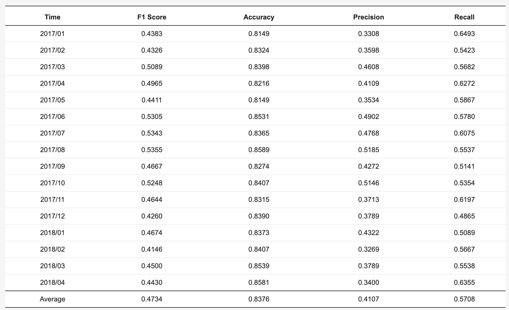
```

---
# Rendimiento promedio del modelo DNN para distintas métricas.

<br>

```{r, echo=FALSE, out.width='80%', fig.align='center'}
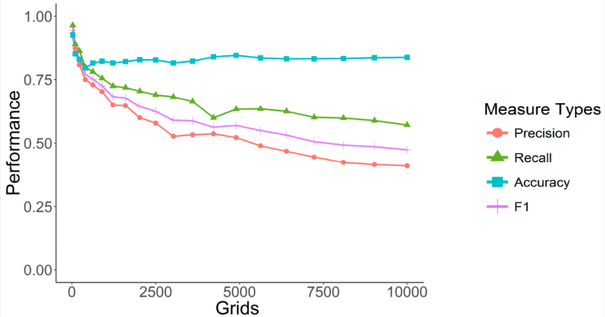
```

---

# Importancia de variables

🔸 Se ejecutan las predicciones agregando dos escenarios, excluyendo las variables geográficas y dejando únicamente las variables geográficas.

<br>

```{r, echo=FALSE, out.width='80%', fig.align='center'}
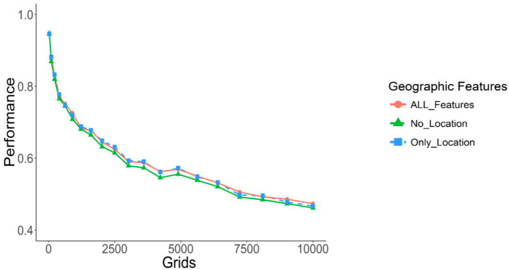
```

---

# Importancia de variables

🔸 Calculando la suma acumulada de las 10 características más importantes de un período de 16 meses.


```{r, echo=FALSE, out.width='80%', fig.align='center'}
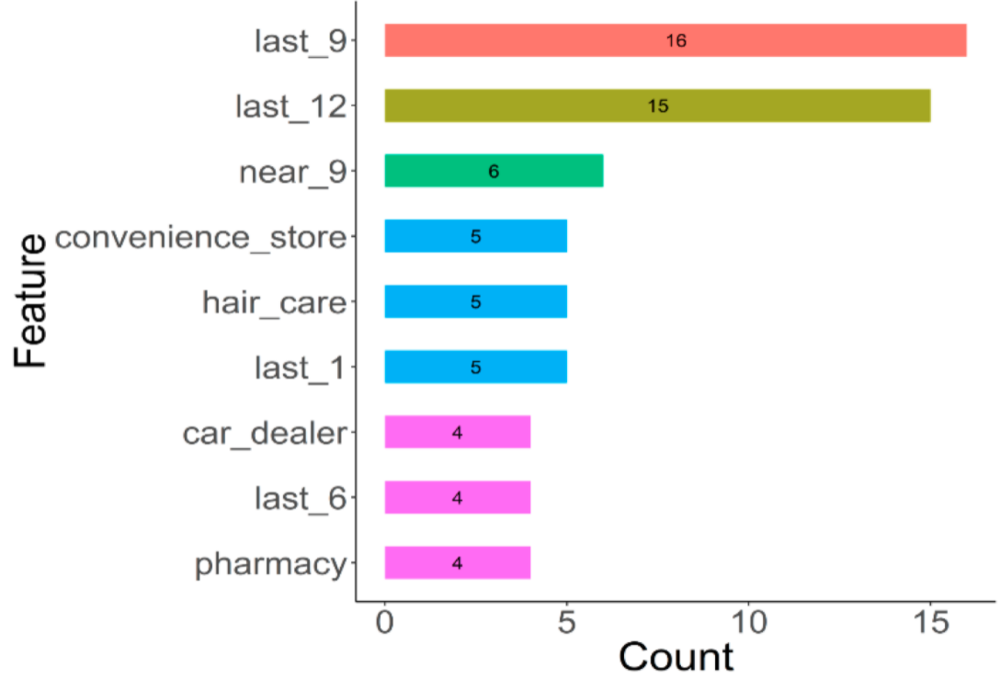
```

🔸 Se muestra que los factores espacio-temporales siguen siendo los más influyentes en la cuadrícula.

---
# Conclusiones

🔸 Los enfoques tradicionales basados en cuadrículas, muestran que un conjunto de entrenamiento de características excesivamente pequeño da como resultado una superposición de información excesiva.
 
🔸 Se pueden generar nuevas características para mejorar las predicciones,  pero un gran número de características puede no ser lo más adecuado debido a la existencia de correlaciones débiles.
 
🔸 Esta es la razón por la que el DNN supera a las técnicas tradicionales de aprendizaje automático y los enfoques de series de tiempo, permitiendo usar más características con relaciones más complejas, que permitan mejorar la discriminacion de las observaciones, sin ser afectados por las correlaciones débiles del exceso de variables. 

🔸 El principal desafío del estudio, estaba concentrado en la extracción de las características de las cuadrículas, punto que fue parcialmente solventado por la API de Google Place. Este punto fue clave, especialmente para incorporar el factor latente de la movilidad del delito a distintos ambientes según patrones estacionales.

---

# Futuras investigaciones o mejoras

🔸 El juicio experto de los agentes de policías no debe sustituirse por los avances tecnológicos y de modelado, todo lo contrario, deben complementarse y existir una retroalimentación para usar de mejor manera las bases de datos.
 
🔸 Se abre la posibilidad de incluir otro tipos de variables predictivas, como por ejemplo bares, y territorios de pandillas, junto con características que inhiben el crimen, como cámaras de vigilancia y estaciones de policía. 
 
🔸 Las variables meteorológicas como el clima y la temperatura, también pueden considerarse.
 
🔸 Se pueden indexar nuevas variables que describen el desplazamiento del crimen, como acciones policiales, controles y zonas de amortiguamiento para simular los efectos del desplazamiento con mayor precisión.

---

class: center, middle

# Muchas Gracias !!

## Contacto ✉
Rafael Zambrano [](https://twitter.com/rafa_zamr) [](https://www.linkedin.com/in/rafael-zambrano/) [](https://github.com/rafzamb) [](https://rafael-zambrano-blog-ds.netlify.app/)

